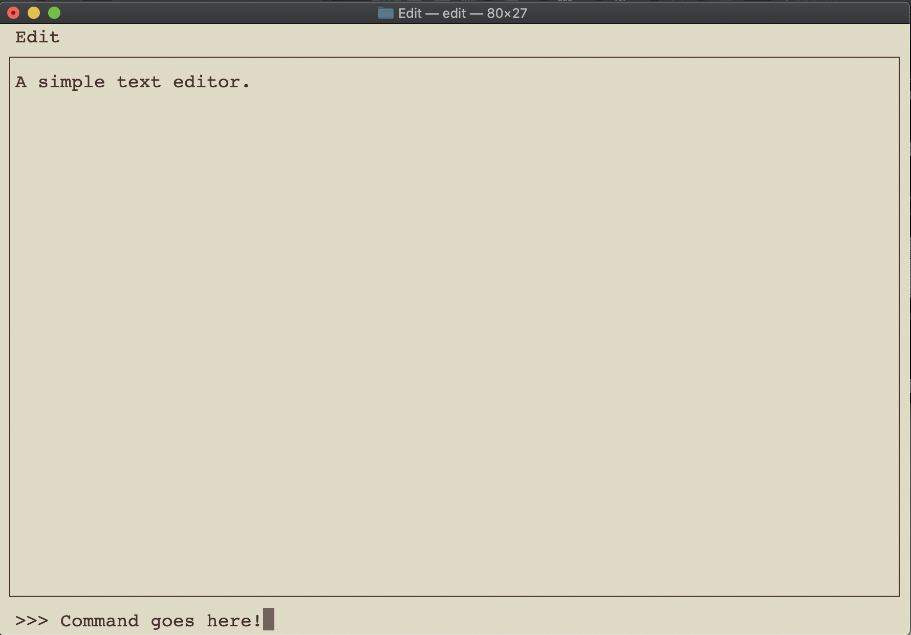

# Edit - A basic shell text editor.

Edit is a toy project that was intended to give me a bit of experience using (n)curses for manipulating a terminal window.

The basic design incorporates elements of Emacs/Vim, with a custom Python-based minibuffer for scripting/commands. I was able to progress far enough that I felt comfortable with curses, implementing some bare-bones features:
* basic editing of the buffer,
* reading/writing of files,
* a time-based autosave system inspired by Emacs,
* some very basic minibuffer action.

## Bugs

Lots! I haven't really had the time to touch the source in years, so I'm confident that things have broken since then.